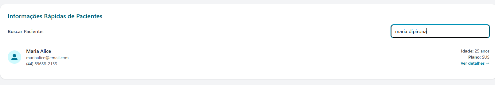
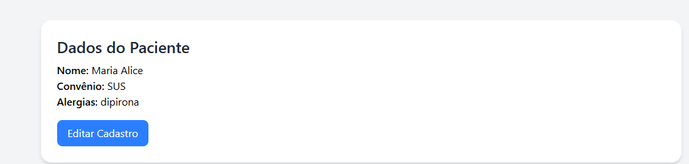
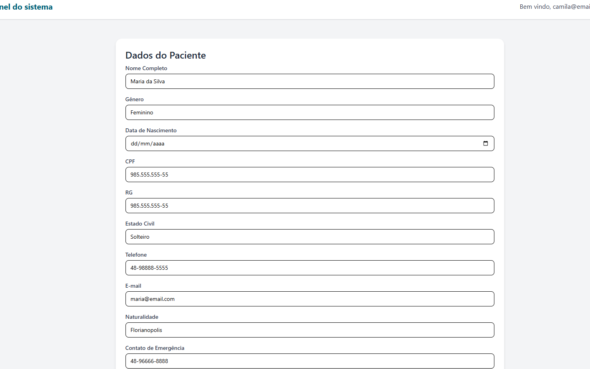
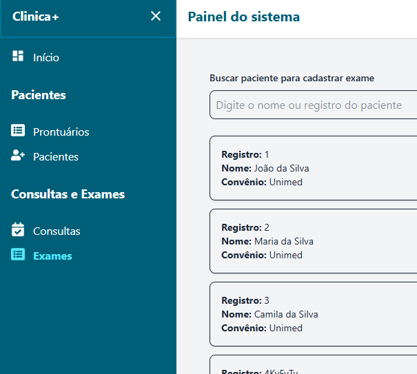

# 🔍 Comparativo do Campo de Busca --- Versão Original vs. Versão Aprimorada

Este documento descreve a evolução do campo de busca do módulo de
Pacientes, comparando a versão original com a versão aprimorada, além de
explicar como a nova implementação funciona.

------------------------------------------------------------------------

## 📌 Versão Original

A versão inicial do campo de busca filtrava pacientes apenas pelos
campos:

-   **Nome**
-   **Email**
-   **Telefone**

### Componente JSX original

``` jsx
<div className="flex flex-col sm:flex-row sm:items-center sm:justify-between mb-4 gap-3">
    <label htmlFor="search" className="text-gray-700 font-medium">
        Buscar Paciente:
    </label>
    <input
        type="text"
        id="search"
        value={searchTerm}
        onChange={handleSearchChange}
        placeholder="Digite o nome, email ou telefone"
        className="border rounded-lg px-3 py-2 w-full sm:w-80 focus:ring-2 focus:ring-cyan-600 outline-none"
    />
</div>
```

------------------------------------------------------------------------

## 🚀 Versão Aprimorada

A nova versão expande significativamente a capacidade de busca,
permitindo pesquisar o paciente por diversos campos ao mesmo tempo.
Todos os valores relevantes são unificados em uma única string para
comparação.

### Novo código de filtragem

``` javascript
const filteredPatients = patients.filter((patient) => {
    const combined = Object.values({
        insuranceNumber: patient.insuranceNumber,
        cpf: patient.cpf,
        email: patient.email,
        name: patient.fullName,
        phone: patient.phone,
        rg: patient.rg,
        birthdate: patient.birthdate,
        allergies: Array.isArray(patient.allergies) 
            ? patient.allergies.join(" ") 
            : patient.allergies
    })
        .filter(Boolean)
        .join(" ")
        .toLowerCase();

    return searchTerm
        .toLowerCase()
        .split(" ")
        .every(term => combined.includes(term));
});
```

------------------------------------------------------------------------

## 🆚 Diferenças Entre as Versões

  -----------------------------------------------------------------------------------
  Item                   Versão Original             Versão Aprimorada
  ---------------------- --------------------------- --------------------------------
  **Campos pesquisados** Nome, email, telefone       Nome, email, telefone, CPF, RG,
                                                     data de nascimento, convênio,
                                                     alergias

  **Busca por múltiplos  ❌ Não                      ✔️ Sim
  termos**                                           

  **Busca ampla em todos ❌ Não                      ✔️ Sim
  os campos**                                        

  **Suporte a listas     ❌ Não                      ✔️ Sim
  (ex: alergias)**                                   

  **Case-insensitive**   Parcial                     ✔️ Total

  **Flexibilidade**      Baixa                       Alta
  -----------------------------------------------------------------------------------

------------------------------------------------------------------------

## 🛠️ Como funciona a nova filtragem

1.  Coleta diversos campos do paciente.\
2.  Remove valores nulos ou vazios (`filter(Boolean)`).\
3.  Une todos os campos em uma única string (`join(" ")`).\
4.  Converte tudo para minúsculas.\
5.  Divide o termo de busca em palavras.\
6.  Verifica se todas as palavras aparecem no conteúdo combinado.

------------------------------------------------------------------------

## 🎯 Exemplos de buscas possíveis agora

-   `joao silva`
-   `maria convenio ouro`
-   `12345678900`
-   `rg 55`
-   `alergia sulfa`
-   `1990 joana`
-   `plano ouro 1212`

------------------------------------------------------------------------

## ✅ Benefícios da nova implementação

-   Mais eficiente e completa\
-   Suporta listas e múltiplos tipos de dados\
-   Fácil de expandir\
-   Busca natural e intuitiva



------------------------------------------------------------------------

# 🔍 Adição do Campo de Edição dos Dados do Paciente 

# Melhorias Implementadas no Sistema de Pacientes

Este documento descreve as melhorias adicionadas ao componente
**PatientDetails** e a criação do novo componente **PatientForm**,
permitindo agora a edição completa dos dados do paciente.

------------------------------------------------------------------------

## ✅ Problema Original

O sistema exibia os dados do paciente, mas **não havia forma de editar
suas informações básicas**, como nome, convênio, endereço, contatos etc.

Somente consultas e exames tinham edição funcional.

------------------------------------------------------------------------

## 🔧 Melhorias Adicionadas

### 1. ✨ Criação do componente **PatientForm**

Um novo componente foi criado para lidar exclusivamente com a edição do
cadastro do paciente.

Esse componente:

-   Recebe o objeto `patient`
-   Cria controls para todos os campos (dados pessoais + endereço)
-   Atualiza cada valor com `useState`
-   Retorna o novo objeto completo ao salvar

### 2. ✨ Adição do estado `isEditingPatient` no `PatientDetails`

Esse estado controla o modo de exibição:

-   Quando **false** → mostra os dados do paciente
-   Quando **true** → exibe o `PatientForm` para edição

``` js
const [isEditingPatient, setIsEditingPatient] = useState(false);
```

### 3. ✨ Função `handleEditPatient()`

Ativa o modo de edição do paciente:

``` js
const handleEditPatient = () => {
  setIsEditingPatient(true);
};
```

### 4. ✨ Função `handleSavePatient()`

Responsável por:

-   Receber os dados atualizados do `PatientForm`
-   Enviar um **PUT** para o backend
-   Atualizar o estado local
-   Exibir um toast de sucesso

``` js
const handleSavePatient = async (updatedPatient) => {
  await axios.put(`http://localhost:3000/patients/${id}`, updatedPatient);
  setPatient(updatedPatient);
  toast.success("Paciente atualizado com sucesso!");
};
```

### 5. ✨ Exibição condicional do PatientForm

``` jsx
{isEditingPatient ? (
  <PatientForm
    patient={patient}
    onCancel={() => setIsEditingPatient(false)}
    onSave={handleSavePatient}
  />
) : (
  <>
    <p>...</p>
    <button onClick={handleEditPatient}>Editar</button>
  </>
)}
```

------------------------------------------------------------------------

## 📦 Estrutura do novo componente **PatientForm**

### ✔ Recebe:

-   `patient`
-   `onSave`
-   `onCancel`

### ✔ Possui:

-   Campos simples (nome, CPF, email etc)
-   Campos de endereço agrupados
-   Labels traduzidos para português
-   Controle de estado com `setFormData`
-   Botões de **Salvar** e **Cancelar**

### ✔ Ao salvar:

Envia o objeto completo do paciente para o `PatientDetails`, que faz a
atualização via API.

------------------------------------------------------------------------

## 🚀 Resultado Final

Após as melhorias, agora o sistema permite:

✔ Editar **todos** os dados pessoais do paciente\
✔ Manter a lógica já existente para consultas e exames\
✔ Exibir formulário organizado e completo\
✔ Separar responsabilidades em componentes reutilizáveis\
✔ Criar um fluxo padronizado de edição

------------------------------------------------------------------------

## 🗂 Organização do Código

-   `PatientDetails.jsx` → Lida com lógica, fetch e exibição
-   `PatientForm.jsx` → Lida com edição dos dados do paciente

Essa separação melhora a manutenção e leitura do projeto.

------------------------------------------------------------------------

## 👏 Conclusão

A refatoração trouxe:

-   Melhor componentização\
-   Código mais limpo e organizado\
-   Mais funcionalidade\
-   Melhor experiência de uso


------------------------------------------------------------------------

# Implementação do SideMenu com Active Menu

Este documento explica como foi feita a implementação do **menu lateral (SideMenu)** com suporte a:

- Estado de colapso/expansão (sidebar recolhível)
- Detecção automática do item ativo (active menu)
- Separação visual de seções
- Ícones e navegação com React Router
- Logout integrado ao AuthContext

------------------------------------------------------------------------

## 🔧 1. Importações Principais

Foram utilizados:

- **useState**, **useLocation**, **useNavigate** → gerenciar estado da UI e rotas  
- **react-icons** → para ícones modernos  
- **useAuth** → para logout com contexto  
- **React Router (Link)** → navegação interna

------------------------------------------------------------------------

## 📌 2. Controle de Colapso da Sidebar

Criamos um estado:

```js
const [isCollapsed, setIsCollapsed] = useState(false)
```

E um botão para alternar:

```js
const toggleMenu = () => {
  setIsCollapsed(!isCollapsed)
}
```

A largura do menu muda dinamicamente:

```js
className={isCollapsed ? "w-20" : "w-64"}
```

------------------------------------------------------------------------

## 🎯 3. Implementação do Active Menu

Foi adicionada a função:

```js
const isActive = (path) => location.pathname === path
```

Ela compara a rota atual com a rota do menu.

Depois aplicamos estilos condicionais:

```js
className={`flex items gap-3 hover:text-cyan-300 
  ${isActive('/dashboard') ? 'text-cyan-300 font-bold' : ''}`}
```

Assim o item ativo fica **colorido e em negrito**.

------------------------------------------------------------------------

## 🧭 4. Agrupamento dos Itens do Menu por Seção

Quando o menu está expandido, exibimos títulos de seção:

```js
{!isCollapsed && <h2 className="text-white py-4 font-bold text-lg">Pacientes</h2>}
```

- Se o menu estiver colapsado → títulos somem  
- Se estiver expandido → títulos aparecem

Isso deixa o menu **mais organizado e profissional**.

------------------------------------------------------------------------

## 🔐 5. Função de Logout

Utilizamos o contexto `useAuth()`:

```js
const { logout } = useAuth()
```

E implementamos:

```js
const handleLogout = () => {
  logout()
  navigate("/")
}
```

No botão:

```js
<button className="flex items-center gap-3 text-red-300 hover:text-red-500 w-full">
```

------------------------------------------------------------------------

## ✔️ 6. Resultado Final

O novo SideMenu oferece:

- Destaque automático do item ativo  
- Visual mais moderno e organizado  
- Menu recolhível  
- Seções por categoria  
- Integração com AuthContext e React Router  

O código ficou mais modular, claro e responsivo.


------------------------------------------------------------------------


